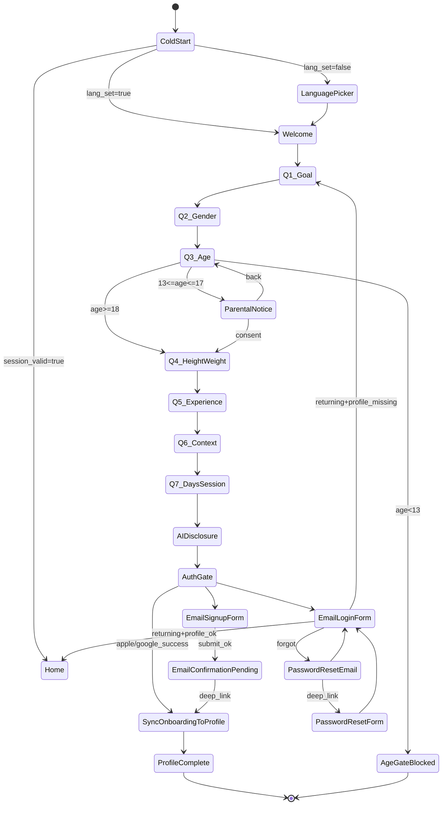

# Product Requirements Document — Auth & Onboarding (Minimal)

**Author:** Balaagha · **Date:** 2026-05-22 (v3.1) · **PM Agent:** John
**Product:** fitnessApp — Azərbaycan bazarına yönəlmiş fitness tətbiqi (AI dəstək qatı, headline deyil — project-context §0)
**PRD Scope (minimal):** Age Gate · Auth (signup / login / session / logout / reset / delete cascade rule) · İlk dəyər **onboarding skeleton** (yalnız Q1→Q7 axın strukturu) · AI Disclosure · Localization · Pregnancy hard-stop
**Canonical reference:** `docs/project-context.md` v3.3 (§0, §1b Volt, §3, §6, §10) + `CLAUDE.md` Repositioning + Qəti Qadağalar

> **v3.1 — Funksional-yalnız PRD (2026-05-22):**
> v3.0-dan **funksional məzmun toxunulmadan** texniki, analitik və UX detalları ayrı sənədlərə bölündü:
> - Data model + API + error codes + KMP layout → `prd-auth-data-model-2026-05-22.md`
> - Event catalog + success metrics → `prd-auth-onboarding-analytics-2026-05-22.md`
> - Ekran inventarı + Volt müqaviləsi + komponent inventarı + accessibility UI → `ux-auth-onboarding-2026-05-22.md`
> Bu PRD yalnız FR, AC, state machine, axın qaydaları və NFR xülasəsi saxlayır.

---

## 0. Executive Summary

Bu PRD `fitnessApp` MVP-nin **giriş qapısının minimal nüvəsidir**: cold start → dil seçimi → Welcome+Privacy → Age Gate → 7 məcburi sual axın strukturu → AI Disclosure → Auth → `user_profiles` upsert → **ProfileComplete**. Üç problemi həll edir: (1) compliance launch-blocker-lər tək yerdə (Age Gate 13+, Apple 2025 AI disclosure, pregnancy hard-stop, Privacy Policy AZ+RU+EN, Google Health Declaration), (2) auth nüvəsi (Email/Apple/Google + reset/delete cascade), (3) onboarding skeleton (7 sual, ≤90 sn, offline-safe). Solo-dev realism: ~2-3 həftə implementasiya.

---

## 1. Vision & Goals

### 1.1 Goals

| # | Goal | KPI | Hədəf |
|---|------|-----|-------|
| G1 | Activation-a sürtüşməni minimuma endir | Onboarding median tamamlanma müddəti | **≤90 saniyə** |
| G2 | Profil keyfiyyəti | 7 məcburi sahənin doldurulması | ≥98% |
| G3 | Cross-platform tutarlılıq | iOS + Android onboarding state | %100 paritet |
| G4 | Offline-safe başlanğıc | Offline onboarding completion + sync success | ≥99% |
| G5 | Native AZ etibar | İlk 3 ekranda machine-translated string | **0** |
| G6 | Compliance | App Store + Google Play submission rədd | **0 rədd** |

### 1.2 Non-Goals — Bu PRD ETMƏYECƏK

- **Paywall touchpoint** → `prd-paywall-deferred-2026-05-22.md`
- **Sample Workout Preview** → `prd-sample-workout-preview-deferred-2026-05-22.md`
- **Settings / Profile edit / Logout sync modal / Account delete UI** → `prd-settings-deferred-2026-05-22.md`
- **Professional Coaching Teaser** → `prd-professional-coaching-teaser-deferred-2026-05-22.md`
- **19 opsiyonel sahə UI tetiklenməsi + Q1-Q7 copy/validation detalları** → `prd-user-profile-data-catalog-2026-05-22.md`
- AI workout plan, exercise library, calorie tracker, streak — ayrı PRD-lər
- Phone OTP, 2FA, Facebook/X social login — Faza 2
- Profile preview ekranı (BMR/TDEE compute UI) — sample-preview PRD-də
- Cycle tracking — Faza 2

---

## 2. Personas (qısa referans)

| Persona | Profil | Auth üstün | Detal |
|---------|--------|-----------|-------|
| A/B/C/D | Bax aşağı | — | → `docs/project-context.md` §3-§6 + `prd-user-profile-data-catalog-2026-05-22.md` (persona-cell matrisi) |

- **A** — Şəhərli professional qadın 25-35, iPhone, Apple Sign-In
- **B** — Gənc kişi zal-go-er 18-30, Android, Google Sign-In
- **C** — Yaşlı sağlamlıq-driven 35-50, Email+Pwd, accessibility-həssas
- **D** — Hamilə / postpartum (Q2=female + opsiyonel `pregnancy_postpartum=true`) — §3.8 hard-stop cohort

---

## 3. Auth + Onboarding Skeleton Müqaviləsi

### 3.1 Onboarding 7 məcburi sual — AXIN strukturu (skeleton)

Bu PRD yalnız Q1→Q7 **ardıcıllığını və axın qaydalarını** bağlayır. Hər sualın copy (AZ/RU/EN), validation, default, sub-label, persona-cell impact → **`prd-user-profile-data-catalog-2026-05-22.md`**.

| # | Field | Type | Validation kateqoriyası |
|---|-------|------|--------------------------|
| Q1 | `goal` | enum `bulk \| cut \| general_fit` | məcburi, default seçilməmiş |
| Q2 | `gender` | enum `male \| female` | məcburi |
| Q3 | `age` | int 13-99 | məcburi · **§3.6 Age Gate trigger** |
| Q4 | `height_cm` + `weight_kg` | int + decimal | hər ikisi məcburi (eyni ekran) |
| Q5 | `experience_level` | enum `beginner \| intermediate \| advanced` | məcburi |
| Q6 | `context` | enum `serious_gym \| casual_gym \| home_only` | məcburi |
| Q7 | `weekly_days` + `session_duration_min` | int 2-7 + enum 15/30/45/60 | hər ikisi məcburi (eyni ekran) |

**Axın qaydaları (skeleton):**
- **Tək sual / ekran** (Q4 və Q7 istisna — 2 field eyni ekran)
- **Sıra dəyişməz:** Q1→Q2→Q3→...→Q7. Q3 cavabı §3.6 Age Gate tetiklər.
- **Median tamamlanma:** ≤90 sn (G1)
- **Cap:** 7-dən artıq məcburi sual əlavə etmək hard-prohibited (CLAUDE.md)
- **19 opsiyonel sahə:** onboarding axınında **YOXDUR** — Settings → Profile-də və ya plan-trigger-də inject olur

### 3.2 Cross-cutting axın qaydaları (Q1-Q7)

**Back-navigation:**
- Q{N} (N=2..7) → geri → Q{N-1}; əvvəlki cavab **qorunur və pre-selected**
- Q1 → geri → Welcome
- Cavab dəyişikliyi downstream cavabları **silmir** (yalnız Q2/Q6 dəyişərsə Q7-dən sonra persona_cell yenidən hesablanır)
- **İstisna:** AgeGateBlocked terminal — back yox; ParentalNotice back → Q3

**Offline davranış (NFR-O1, NFR-O4):**
- Hər cavab SQLDelight `onboarding_state`-ə dərhal yazılır (network tələbi yox)
- Axın heç bir nöqtədə network-ə bloklanmır
- AuthGate offline-da render olunur; submit `AUTH_007` toast; cavablar itmir
- Online keçidində `migrate_onboarding` background sync (idempotent: `device_id + user_id`)

**Loading state:**
- Ekran keçidi <200ms (NFR-P2) — spinner göstərilmir
- Network çağırışda CTA `volt` progress/disabled + inline spinner; double-tap qarşısı alınır
- >10s gecikmədə "Bağlantı yavaşdır..." `text-secondary` alt-mətn

### 3.3 Welcome + Privacy ekranı

- Dil seçimindən sonra, Age Gate-dən əvvəl
- Logo + 1 cümlə value prop
- **Privacy link 3 sıra məcburi:** Privacy Policy · Terms of Service · Health Data Usage (seçilmiş dildə)
- CTA: "Başla" (AZ) / "Начать" / "Start"

### 3.4 Auth gate

- AI Disclosure (§3.5) tamamlandıqdan sonra
- iOS sıra: **Apple → Google → Email** (HIG)
- Android sıra: **Google → Email** (Apple göstərilmir)
- Provider sheet cancel → silent (AUTH_008/010)

### 3.5 AI Disclosure Screen (Apple 2025 məcburi)

- **Trigger:** Q7 tamamlandıqdan sonra, **hər user-ə bir dəfə**, dismissable deyil
- **Ton:** sakin, minimal — kahraman ekran DEYİL; "AI sehri" / animasiya yox (project-context §0)
- **AZ başlıq:** "Planın necə hazırlanır"
- **AZ body (v3.3 update — 2026-05-23 axşam):** "Plan AI tərəfindən elmi əsaslarla qurulur — son qərar səndədir, istədiyin vaxt dəyişə bilərsən. **Premium istifadəçilərdə plan, göndərilmədən əvvəl bir mütəxəssis tərəfindən yoxlanılıb onaylanır.** Bu tibbi məsləhət deyil — sağlamlıq probleminiz varsa məşqdən əvvəl həkimə müraciət edin."
- ⚠️ **STRATEJI QEYD (v3.3, 2026-05-23 axşam — DÜZƏLİŞ):** Premium-da insan-onayı **human approval / quality gate**-dir, **trainer feature DEYİL**. Plan AI-dən gəlir; mütəxəssis yalnız təhlükəsizlik/uyğunluq yoxlaması edir — fərdi məşqçi-istifadəçi münasibəti, chat, fərdi koreksiya YOXDUR. CLAUDE.md "trainer və ya professional coaching vəd etmə" qaydası **KEÇƏRLİDİR**. Marketing/copy/onboarding-də "məşqçi/coach/trainer" sözü qadağan; istifadə olunan termin: "**mütəxəssis yoxlaması**" və ya "**uyğunluq yoxlaması**".
- **RU/EN:** ekvivalent (catalog PRD-də tam)
- **CTA:** "Anladım" + "Ətraflı" (→ Privacy Policy AI section)
- **Persistence:** `ai_disclosure_accepted_at` user_profiles-də (auth-dan sonra)

### 3.6 Age Gate (launch-blocker, project-context §3.6)

#### 3.6.1 Hard-stop (<13)
- **Trigger:** Q3 cavabı `<13`
- **UI:** Terminal — back yox, "Yenidən cəhd et" yox
- **AZ:** "Bu app 13 yaşından kiçik istifadəçilər üçün nəzərdə tutulmayıb"
- Sub-action: "Çıxış" CTA
- **Bypass YASAQ:** `email_hash` (SHA-256) + `device_id` **30 gün cache** SQLDelight `age_gate_blocked`
- **User-da hesab yaradılmır** — Supabase Auth çağırışı baş vermir

#### 3.6.2 Parental Notice (13-17)
- Welcome-bənzər + **məcburi checkbox** ("Valideynim/qəyyumum bu app-i istifadə etməyimə icazə verir")
- Checkbox işarələnməyincə "Davam et" disabled
- Persistence: `user_profiles.parental_consent_at` (auth-dan sonra)

#### 3.6.3 Hash bypass yoxlaması
- Email + age hash `age_gate_blocked` SQLDelight-də 30 gün
- Eyni email ilə fərqli yaş → `age_gate_retry` event log
- **Server-side double-check:** signup-dan əvvəl Edge Function `check_age_gate(email_hash, age)` — 30 gün ərzində `<13` history → signup RƏDD (`AUTH_012`)

#### 3.6.4 Legal
- Self-attested yaş (industry standard)
- Terms of Service-də "13+ minimum age" + "valideyn icazəsi <18" klauzu məcburi
- AZ Personal Data Protection Law uyğunluğu

### 3.7 Localization & String Fallback (project-context §3.7)

- **Resource keys:** `shared/strings/{az,ru,en}.json`; naming: `feature.subfeature.action_label`
- **Fallback chain:** **AZ → RU → EN → key-itself** (debug builds-də key-itself red border)
- **Missing key analytics:** `missing_strings { key, language_requested, fallback_used }`
- **MT detection (CLAUDE.md MT YASAQ):** CI gate — `name_az` translation memory hash diff >30% → manual review queue (CI fail)
- **Pluralization:** CLDR (AZ singular/plural, RU 3-form, EN 2-form)
- **RTL:** MVP-də YOX
- **Runtime dil dəyişdirilməsi:** app re-launch tələb etmir (Settings UI ayrı PRD-də)

### 3.8 Pregnancy hard-stop (project-context §6.3)

Bu PRD pregnancy **nudge UI-ı** definisiyalamır (sample preview PRD-də). Lakin **hard-stop DATA qaydası burada bağlanır**:

- `user_profiles.pregnancy_postpartum = true` set edildikdə:
  - AI plan generasiyası **bloklanır** (plan PRD tətbiq edir)
  - Modifier precedence: **pregnancy > injury > Ramazan > home_only_F > cut**
- **Hard-stop ekran:** curated static template + medical disclaimer (plan PRD)
- **Bu PRD-də:** schema sütunu + RLS oxunma icazəsi + safety modifier precedence

---

## 4. State Machine — Auth + Age Gate + 7-sual onboarding

### 4.1 State transitions (qısa cədvəl: from → to → trigger → guard)

| From | To | Trigger | Guard / Side-effect |
|------|-----|---------|---------------------|
| ColdStart | Home | session_valid=true | Token refresh |
| ColdStart | LanguagePicker | session=false, lang=false | — |
| ColdStart | Welcome | session=false, lang=true | — |
| LanguagePicker | Welcome | select(az/ru/en) | app_settings write |
| Welcome | Q1_Goal | tap(Başla) | start ≤90s timer |
| Q{N} | Q{N+1} | submit | SQLDelight write |
| Q3_Age | AgeGateBlocked | submit(age<13) | age_gate_blocked insert; signup forbidden |
| Q3_Age | ParentalNotice | 13≤age≤17 | — |
| Q3_Age | Q4_HeightWeight | age≥18 | — |
| ParentalNotice | Q4_HeightWeight | check + tap(Davam) | parental_consent_pending=true |
| ParentalNotice | Q3_Age | back | — |
| Q7 | AIDisclosure | submit | onboarding_completed event |
| AIDisclosure | AuthGate | tap(Anladım) | ai_disclosure_accepted_at |
| AuthGate | provider sheet | tap(Apple/Google) | — |
| AuthGate | EmailSignupForm | tap(Email signup) | — |
| AuthGate | EmailLoginForm | tap(Daxil ol) | — |
| EmailSignupForm | EmailConfirmationPending | submit_ok | magic link |
| EmailSignupForm | EmailSignupForm | AUTH_001-003/006/007 | inline/modal/toast |
| EmailSignupForm | AuthGate | back | onboarding_state qorunur |
| EmailConfirmationPending | SyncOnboardingToProfile | deep link | session yaradılır |
| EmailLoginForm | Home | submit_ok(returning, profile ok) | — |
| EmailLoginForm | Q1_Goal | submit_ok(profile missing) | partial re-entry |
| EmailLoginForm | EmailLoginForm | AUTH_004/006/007 | inline qalır |
| EmailLoginForm | EmailConfirmationPending | AUTH_005 + resend | — |
| EmailLoginForm | PasswordResetEmail | tap(Parolu unutdum) | — |
| PasswordResetEmail | EmailLoginForm | submit | toast (enumeration-safe) |
| PasswordResetForm | EmailLoginForm | submit_ok | re-login |
| PasswordResetForm | PasswordResetEmail | AUTH_013 | "Yeni link" |
| AuthGate | SyncOnboardingToProfile | auth_success(new) | — |
| AuthGate | Home | auth_success(returning) | — |
| SyncOnboardingToProfile | ProfileComplete | success | profile written |
| SyncOnboardingToProfile | ProfileComplete | fail (ONB_004) | background retry; user-ə görünməz |
| ProfileComplete | (handoff) | — | bu PRD bitir; → sample preview PRD |

> **Terminal state-lər:** `AgeGateBlocked` (qəsdli hard-stop, back yox) · `ProfileComplete` (uğurlu çıxış, handoff).

---

## 5. Funksional Tələblər (FR)

| ID | Tələb | Priority | Ref |
|----|-------|----------|-----|
| **FR-1** | App ilk açılışda dil seçimi göstərməli (AZ default əgər system locale `az_AZ`) | P0 | §3.7 |
| **FR-2** | Onboarding **dəqiq 7 məcburi sual** ilə məhdudlaşmalı; 8-ci əlavə etmək hard-prohibited | P0 | CLAUDE.md |
| **FR-3** | Hər onboarding cavabı SQLDelight `onboarding_state`-ə real-time yazılmalı (offline-safe) | P0 | §3.2 |
| **FR-4** | Supabase Auth 3 metodu: Email/parol, Google OAuth, Apple Sign-In (iOS məcburi) | P0 | §3.4 |
| **FR-5** | iOS Apple Sign-In düyməsi AuthGate-də **birinci** sıradadır (HIG) | P0 | §3.4 |
| **FR-6** | JWT refresh token iOS Keychain / Android EncryptedSharedPreferences-də şifrəli | P0 | NFR §10 |
| **FR-7** | Onboarding completion → `user_profiles` Supabase upsert (RLS) | P0 | data-model spec |
| **FR-8** | Anonymous onboarding state `device_id` ilə əlaqəli, auth-da `user_id`-ə miqrasiya | P0 | data-model spec |
| **FR-9** | Password reset Supabase magic link + deep link (`fitnessapp://reset`) | P0 | data-model spec §2.4 |
| **FR-10** | Logout: secure storage tokens silinir; local profile cache saxlanır | P0 | (UI: settings PRD) |
| **FR-11** | `<13` yaş → Age Gate hard-stop, signup transaction abort | P0 | §3.6.1 |
| **FR-12** | `13-17` yaş → Parental Notice + məcburi consent | P0 | §3.6.2 |
| **FR-13** | Email + age hash 30 gün cache; server-side `check_age_gate` double-check | P0 | §3.6.3 |
| **FR-14** | Dil runtime swap-ı app re-launch tələb etməməli | P0 | §3.7 |
| **FR-15** | Onboarding resume (7 gün TTL) yarımçıq sessiyaları davam etdirməli | P1 | §3.2 |
| **FR-16** | Apple "Hide my email" relay email-i `users.email`-də problemsiz | P0 | data-model spec |
| **FR-17** | **AI disclosure ekranı** məcburi — Q7 sonrası, AuthGate-dən əvvəl; `ai_disclosure_accepted_at` saxlanır | P0 | Apple 2025 §3.5 |
| **FR-18** | Privacy Policy (AZ+RU+EN) linkləri Welcome və AuthGate-də məcburi; submission öncəsi yayınlanmalı (launch blocker) | P0 | CLAUDE.md |
| **FR-19** | Google Play Health Declaration form submission öncəsi (admin task) | P0 | CLAUDE.md |
| **FR-20** | RLS məcburi: `user_profiles`, `age_gate_blocked` (service-role), `users` — `auth.uid() = user_id` policy | P0 | CLAUDE.md |
| **FR-21** | Onboarding median tamamlanma analytics: `onboarding_started_at` → `onboarding_completed_at` (Q7 submit) | P0 | G1 |
| **FR-22** | Email enumeration qoruması password reset-də (sabit response) | P0 | NFR-Security |
| **FR-23** | Auth uğursuz cəhdlər inline error AZ/RU/EN; rate limit 5 cəhd / 15 dəq / IP+email | P0 | NFR-Security |
| **FR-24** | Onboarding cavabları offline tam tamamlana bilir; sync queue idempotent (`device_id + user_id`) | P0 | NFR-Offline |
| **FR-25** | Localization fallback: AZ→RU→EN→key; debug-da key red border; `missing_strings` event | P0 | §3.7 |
| **FR-26** | Pregnancy hard-stop **data qaydası**: `pregnancy_postpartum=true` → modifier precedence pregnancy > injury > Ramazan > home_only_F > cut; AI plan blocked | P0 | §3.8 |
| **FR-27** | Account delete **cascade qaydası** (DATA): `progress_logs → calorie_logs → workouts → user_profiles → users (soft-delete 30 gün grace)` + Storage purge. UI flow → settings PRD. | P0 | data-model spec §1.6 |

---

## 6. Persona-cell hesabı (data qaydası)

Q7 submit-dən sonra `shared/calc/persona_resolver.kt` (KMP) `{context × sex × goal}` → `user_profiles.persona_cell` text sütununa yazır. UI-də göstərilmir.

**Formula:** `persona_cell = ${context}.${gender}.${goal}` (məs. `serious_gym.male.bulk`) · **8-cell matrisi:** 3 context × 2 gender × 3 goal = 18 nəzəri cell, MVP 8 aktiv cell.

| Aktiv cell nümunəsi | Context | Gender | Goal |
|---------------------|---------|--------|------|
| `serious_gym.male.bulk` | serious_gym | male | bulk |
| `home_only.female.general_fit` | home_only | female | general_fit |

Tam 8-cell + AZ-kültür adapter detalları → `prd-user-profile-data-catalog-2026-05-22.md`. Bu PRD: schema sütunu + resolver çağırışı + `pregnancy_postpartum` modifier flag.

---

## 7. Data Model
→ `prd-auth-data-model-2026-05-22.md`

## 8. API Contracts
→ `prd-auth-data-model-2026-05-22.md`

---

## 9. User Stories & Acceptance Criteria

### Epic 1 — Authentication

#### US-1.1 — Email + Parol Signup

**AC:**
- Given AuthGate, When "Email ilə qeydiyyat" seçilir, Then email + parol + parol təsdiq sahələri görünür
- Given valid email + parol (≥8 char, ≥1 rəqəm), When submit, Then Supabase `signUp` çağırılır
- Given Supabase email confirmation aktiv, When signup uğurlu, Then "Email-ini təsdiqlə" ekranı + magic link
- Given təsdiq olunmamış email, When login, Then `AUTH_005` banner + "Linki yenidən göndər"
- Given parol < 8 char / rəqəmsiz, Then `AUTH_002` inline
- Given mövcud email, Then `AUTH_003` inline + "Daxil ol" CTA
- Given rate limit, Then `AUTH_006` modal
- Given submit gözlənir, Then CTA disabled + `volt` spinner; double-tap qarşısı alınır
- Given cihaz offline, Then `AUTH_007` toast; form sahələri qorunur

#### US-1.2 — Google Sign-In

**AC:**
- Given AuthGate, When "Google ilə davam et" basılır, Then native Google sheet
- Given user seçir, Then Supabase OAuth callback, JWT alınır
- Given ilk dəfə (`is_new_user=true`), Then `public.users` insert (provider=google) + SyncOnboardingToProfile
- Given cancel, Then silent (`AUTH_008`)
- Given Google API failure, Then `AUTH_009` toast
- iOS order: Apple #1, Google #2, Email #3. Android: Google #1, Email #2, Apple yox.

#### US-1.3 — Apple Sign-In (iOS məcburi)

**AC:**
- Given AuthGate iOS, Then "Apple ilə davam et" **birinci** (HIG)
- Given Apple Sign-In tamamlanır, Then Supabase OAuth callback
- Given "Hide my email", Then `public.users.email` relay saxlayır (`xyz@privaterelay.appleid.com`)
- Given Android, Then düymə **göstərilmir**
- Given cancel, Then silent (`AUTH_010`)
- Given API failure, Then `AUTH_011` toast
- Apple HIG system button (custom design YASAQ)

#### US-1.4 — Email + Parol Login

**AC:**
- Given AuthGate "Daxil ol", Then email + parol field
- Given valid credentials, Then session yaradılır
- Given invalid, Then `AUTH_004` inline
- Given unconfirmed, Then `AUTH_005` banner
- Given returning user, Then Home
- Given returning user-də profile eksik, Then Q1-dən başlayır

#### US-1.5 — Session Persistence

**AC:**
- Given uğurlu login, Then JWT secure storage (iOS Keychain `kSecAttrAccessibleWhenUnlockedThisDeviceOnly` / Android EncryptedSharedPreferences Tink AEAD)
- Given cold start, Then `SessionManager` token oxuyur, expired-sə refresh
- Given refresh token >30 gün / invalid, Then AuthGate
- Given logout, Then secure storage silinir; SQLDelight `user_profiles` cache saxlanır

#### US-1.6 — Password Reset

**AC:**
- Given "Parolu unutdum", Then email input
- Given submit, Then `resetPasswordForEmail` + confirmation toast
- Given magic link tap, Then `fitnessapp://reset?token=...` app açır
- Given deep link, Then yeni parol forması, submit → login
- Given mövcud olmayan email, Then **sabit response** "Əgər email qeydiyyatdadırsa, link göndərildi"
- Given expired token, Then `AUTH_013` + "Yeni link"

#### US-1.7 — Logout (skeleton)

**AC:**
- Given user authenticated, When logout çağırılır, Then Supabase `signOut` + secure storage tokens silinir
- Given offline logout, Then yerli storage təmizlənir, Supabase signOut retry queue
- Given SQLDelight `user_profiles` cache, Then qorunur (re-login üçün)

> Sync-queue blocking modal + data-loss confirmation UI → `prd-settings-deferred-2026-05-22.md`.

#### US-1.8 — Account Delete (data qaydası)

**AC:**
- Given `delete_account` Edge Fn çağırılır (UI: settings PRD), Then data-model spec §1.6 cascade tam icra
- `users.deleted_at = now()`, `delete_grace_until = now() + 30d`
- Storage `userId/*` Edge Fn batch purge schedule
- Re-login grace-də → `restore_account` → `deleted_at = NULL` → Home + `delete_aborted_reopen` analytics
- Grace bitir → cron `hard_purge_account` → `auth.users` DELETE

---

### Epic 2 — Onboarding Skeleton

#### US-2.0 — Language Picker

**AC:**
- Given cold start + language unset, Then 3 düymə (AZ/RU/EN)
- Given system locale `az_AZ`, Then AZ default pre-selected
- Given seçim, Then `app_settings.language` saxlanır, UI runtime swap
- Given Settings → Language dəyişdirilir (settings PRD), Then snackbar: "Dil dəyişdirildi"

#### US-2.0a — Q1-Q7 cross-cutting AC

> Bu blok Q1-Q7-nin **hamısına** tətbiq olunur.

**AC (Back-navigation):**
- Q{N} (N=2..7) → geri → Q{N-1}; əvvəlki cavab pre-selected
- Q1 → geri → Welcome
- Downstream cavablar silinmir (yalnız Q2/Q6 dəyişikliyi Q7-dən sonra persona_cell yenidən hesablayır)
- İstisna: AgeGateBlocked terminal; ParentalNotice back → Q3

**AC (Offline):**
- Hər cavab SQLDelight `onboarding_state`-ə dərhal yazılır
- AuthGate offline render olunur; submit `AUTH_007` toast; cavablar itmir
- Online keçidində `migrate_onboarding` background sync (idempotent)

**AC (Loading):**
- Ekran keçidi <200ms
- Network çağırışda CTA `volt` progress/disabled + inline spinner
- >10s gecikmədə "Bağlantı yavaşdır..." alt-mətn

#### US-2.1 — User 7 məcburi sualı tamamlayır

**AC:**
- Given Welcome → "Başla", When user Q1-Q7 ardıcıllığını cavablayır, Then median ≤90 sn (G1)
- Given hər sual, When validation pass, Then "Davam et" enabled; SQLDelight write
- Given Q3 cavabı `<13`, Then AgeGateBlocked terminal (`age_gate_blocked` insert; signup forbidden)
- Given Q3 `13-17`, Then ParentalNotice; consent yox-sa "Davam et" disabled (`ONB_005`)
- Given Q7 submit, Then `onboarding_completed { duration_seconds, persona_cell }` analytics + AIDisclosure ekranı
- US-2.0a back-nav, offline, loading qaydaları tətbiq olunur

> Hər sualın detallı AC, copy AZ/RU/EN, validation range, default state, sub-label, persona-cell impact → `prd-user-profile-data-catalog-2026-05-22.md`.

#### US-2.2 — AI Disclosure

**AC:**
- Given Q7 submit, Then məcburi AI disclosure (dismissable deyil; sakin tone)
- Given "Anladım", Then `ai_disclosure_accepted_at = now()` lokal + (auth-dan sonra) user_profiles
- Given back swipe cəhd (iOS), Then bloklanır
- Given app bağlanır, Then re-launch-da state preserved

#### US-2.3 — Onboarding Resume (P1) + Age-gate cache

**AC (Resume):**
- Given user Q3-də app bağlayır (auth-dan əvvəl), Then SQLDelight `onboarding_state` saxlanır (device_id)
- Given re-open, Then resume modal: "Qaldığın yerdən davam et" / "Yenidən başla"
- Given >7 gün (`expires_at < now()`), Then `ONB_003` + "Yenidən başla" tək CTA
- Given auth tamamlandıqdan sonra app silinib reinstall, Then resume YOX

**AC (Age-gate cache):**
- Given cache hit (`age_gate_blocked.expires_at > now()`), When user app açır, Then AgeGateBlocked dərhal — Q1-dən soruşulmur
- Given cache hit, Then `attempts` artırılır
- Given fərqli (≥13) yaş bypass cəhdi, Then `age_gate_retry` event; client keçidə icazə verir, server `check_age_gate` rədd edir (`AUTH_012`)
- Given `expires_at < now()`, Then cleanup; normal axın
- Given offline, Then cache yoxlaması lokal; server double-check yalnız online signup

#### US-2.4 — Sync to Profile (post-Auth)

**AC:**
- Given auth_success(is_new_user=true), Then `migrate_onboarding` Edge Fn
- Given success, Then `user_profiles` upsert (persona_cell computed) + SQLDelight onboarding_state silinir + → ProfileComplete
- Given fail (network), Then UI davam (→ ProfileComplete), background retry (exp backoff, max 5)
- Given fail (RLS / 4xx), Then crashlytics + defensive fallback

---

## 10. Non-Functional Requirements (xülasə)

Tam NFR detalları (cold-start budget, edge fallback, token rotation, deep link TTL) → `prd-auth-data-model-2026-05-22.md` §3.5-§3.6. UI-impacting accessibility → `ux-auth-onboarding-2026-05-22.md` §5. Privacy/telemetry → `prd-auth-onboarding-analytics-2026-05-22.md` §2.5.

| Kateqoriya | Hədəf | Detal |
|------------|-------|-------|
| Performance | Cold-start ≤2s · ekran keçidi <200ms · onboarding median ≤90s · Auth API P95 <1.5s · profile sync P95 <2s | → data-model spec §3.5 |
| Offline & Reliability | Onboarding 100% offline · sync idempotent (`device_id + user_id`) · background retry exp backoff 1/2/4/8/16s max 5 · SQLDelight durable write | parent §3.2 |
| Security | RLS məcburi · email enumeration qorunur · parol min 8+1 rəqəm · rate limit 5/15dəq/IP+email · JWT secure storage · token rotation 1h/30d · deep link TTL 15dəq/24h · Age Gate server double-check · GDPR + AZ Personal Data Protection | → data-model spec §3.6 |
| Accessibility | VoiceOver/TalkBack · touch 44/48dp · Dynamic Type · WCAG AA 4.5:1 · klaviatura naviqasiya | → ux spec §5 |
| Localization | Bütün stringlər `shared/strings/{az,ru,en}.json` · MT YASAQ (CI gate) · CLDR plural · RTL yox · fallback AZ→RU→EN→key | §3.7 |
| Privacy & Compliance | Analytics PII-siz (bucket) · Privacy Policy AZ+RU+EN Welcome+AuthGate · Apple ATT MVP skip · Google Play Health Declaration launch blocker · Apple 2025 AI disclosure (FR-17) | → analytics spec §2.5 |
| Trust | Onboarding zamanı HEÇBIR billing/subscription prompt görünməz · transparent billing kontraktı | → paywall PRD |

---

## 10.1 Design Review Notes (2026-05-23)

Növbəti qərarlar dizayn-review sessiyasında (Sally + design pass) finalize olundu. Bu PRD-də qısa qeyd; tam UX məsələləri `ux-auth-onboarding-2026-05-22.md`-də sənədləşir.

### 10.1.1 Logout sync-queue blocking modal LƏĞV (replaces FR-24 UI hint)

- **Köhnə qərar:** çıxış zamanı pending sync olduqda "X əməliyyat sinxronlaşır" modal göstərilir, user gözləyir.
- **Yeni qərar (2026-05-23):** modal LƏĞV. Sinxronlaşma background-da avtomatik aparılır — user çıxış üçün gözləməz.
  - Android: `WorkManager` `OneTimeWorkRequest` + `NetworkType.CONNECTED` constraint + exponential backoff (1/2/4/8/16s).
  - iOS: `BGTaskScheduler` (`BGProcessingTaskRequest`) + `URLSession.background`.
  - Shared KMP: `SyncQueueRepository` (SQLDelight pending queue, idempotent `device_id + user_id`).
  - Re-login zamanı queue avtomatik resume olunur.
- **Detal:** → `prd-settings-deferred-2026-05-22.md` (yenilənib).
- **Design ref:** köhnə screen `app_design.pen` node `y4JLHj` silindi.

### 10.1.2 Global Offline Banner — UX komponent kontraktı (caeVf)

- **Pattern:** offline rejimdə cihaz hər ekranın üstündə `comp/offline-banner` (44dp hündürlük, `$danger-soft` fill, wifi-off ikon + "İnternet bağlantısı yoxdur" mətn + "Yenilə" CTA) göstərir.
- **Davranış:**
  - Banner cihaz reachability-si false olduqda görünür (`NetworkMonitor` Flow), online olduqda 1 saniyə fade ilə yox olur.
  - Hər screen-də göstərilməsi məcburi DEYİL — yalnız onboarding/auth + workout/calorie data-write tələb edən screen-lərdə. Static info ekranlarında (Welcome, About, Settings list) gizlədilə bilər.
  - "Yenilə" CTA tap olduqda mövcud screen-in əsas data fetch-ini retry edir; banner görünür qalır o vaxta qədər ki, real connectivity bərpa olunur.
- **Telemetri:** `offline_banner_shown {screen, duration_sec}` event background-da yığılır → analytics PRD.
- **Sync-warning variant (planlanır, MVP+1):** vacib sync (məsələn workout session bitir, AI plan generation pending) gözləyəndə eyni banner amber/warning variantı göstərilsin: `$accent-soft` fill + cloud-upload ikon + "X əməliyyat göndəriləcək — bağlantı gözlənir". Bu sadəcə user-confidence verir, blocker deyil.
- **Komponent ownership:** `prd-design-system` (planlanır) və ya `ux-phase3-design-system-spec-2026-05-23.md`-də formal komponent kontraktı.
- **Design ref:** `app_design.pen` node `caeVf` (reusable component, `K2TtZa` V4 ekranında embed olunub).

### 10.1.3 Parental Notice — Privacy/Terms in-app text reader

- **Pattern:** `07 · Parental Notice` (`XG54w`) ekranında "Məxfilik siyasəti" və "İstifadə şərtləri" link-ləri tap olduqda EXTERNAL browser AÇILMIR. PDF də DEYIL. Bunun yerinə in-app **bottom sheet** açılır və mətn HTML-rendered formatda göstərilir.
- **Niyə:** (a) browser keçidi onboarding-ı kəsir, drop-off riski; (b) PDF yoxdur, mətn KMP shared `string-resources` kimi paketlənir, dil-aware (AZ/RU/EN), versionlaşdırma asan; (c) accessibility (VoiceOver/TalkBack birbaşa native render).
- **Bottom sheet kontraktı:**
  - Drag handle + header (kateqoriya etiketi "SƏNƏD" + başlıq "Məxfilik siyasəti" / "İstifadə şərtləri") + close X ikon.
  - Meta chip-lər: son yenilənmə tarixi + dil göstəricisi (AZ default).
  - Scrollable section-block-lər (h2 başlıq + paragraph) — minimum 4 bölmə: data toplama, istifadə, hüquqlar, əlaqə.
  - CTA: "Anladım" (primary) — sheet bağlanır, user XG54w-ə qayıdır.
- **Implementation:** KMP shared `LegalDocument(key:"privacy"|"terms", locale)` model + Compose/SwiftUI `BottomSheet` adapter. Mətnlər `shared/strings/legal/{az,ru,en}/{privacy.md,terms.md}` kimi versionlu saxlanılır.
- **Compliance:** Privacy Policy mətni dəyişəndə user-ə re-consent göstərilmir (MVP-də); yalnız tarix yenilənir. Major dəyişikliklərdə (Faza 2) re-consent flow əlavə oluna bilər.
- **Design ref:** `app_design.pen` node `P5mDxB` (V7 · Parental Notice — BottomSheet).

---

## 11. Analytics Event Catalog
→ `prd-auth-onboarding-analytics-2026-05-22.md`

## 12. Success Metrics
→ `prd-auth-onboarding-analytics-2026-05-22.md`

---

## 13. Out-of-Scope (Bu PRD)

| Out-of-scope | Hand-off |
|--------------|----------|
| Paywall touchpoint, RevenueCat, video bg, iki seçim, transparent billing UI | → `prd-paywall-deferred-2026-05-22.md` |
| Sample Workout Preview (first-value, persona-curated template, 30s engagement) | → `prd-sample-workout-preview-deferred-2026-05-22.md` |
| Settings / Profile edit UI, language change UX, account delete double-confirm (logout sync modal ləğv edildi → §10.1.1) | → `prd-settings-deferred-2026-05-22.md` |
| Pregnancy nudge bottom-sheet UI + curated template flow + Settings management + postpartum auto-archive | → `prd-pregnancy-postpartum-flow-2026-05-23.md` (2026-05-23 design-handoff hazır, 7 ekran canlı) |
| 19 opsiyonel sahə UI, Q1-Q7 sual copy / validation / persona-cell impact detalları, 8-cell persona matrisi | → `prd-user-profile-data-catalog-2026-05-22.md` |
| Professional Coaching Teaser (Faza 2 demand-signal) | → `prd-professional-coaching-teaser-deferred-2026-05-22.md` |
| AI workout plan prompt design | → prd-ai-plan-generation |
| Workout execution, exercise library | → prd-workout-execution |
| Calorie tracker | → prd-calorie-tracking |
| Phone OTP, 2FA, Facebook/X login | Faza 2 |
| Cycle tracking | Faza 2 |
| Streak mexanizmi tətbiqi (schema reserved → workout PRD) | → prd-workout-execution |

---

## 14. Dependencies

| Dep | Type | Status | Risk |
|-----|------|--------|------|
| Supabase Project (EU region) | External | Provision lazım | Aşağı |
| Supabase Auth Email provider config | Config | SMTP / default | Aşağı |
| Apple Developer Program | External | $99/il, KYC | Orta |
| Google Play Console | External | $25 one-time | Aşağı |
| Google Cloud OAuth 2.0 Client ID (Android+iOS) | Config | Setup lazım | Aşağı |
| Apple Sign-In Service ID + Key | Config | Setup lazım | Orta |
| KMP skeleton + Supabase Kotlin SDK | Codebase | YENİ | Yüksək |
| Localization framework (Moko Resources) | Library | Seçim lazım | Aşağı |
| Analytics SDK | Library | TBD | Aşağı |
| Crash reporting | Library | TBD | Orta |
| Privacy Policy + ToS (AZ/RU/EN) | Content | YAZILMALI | Yüksək — legal review |
| Google Play Health Declaration | Admin task | Tamamlanmalı | Yüksək — launch blocker |
| AI Disclosure copy review (Apple 2025) | Content | Yazılmalı | Orta — submission risk |

---

## 15. Risks & Mitigations

| # | Risk | Likelihood | Impact | Mitigation |
|---|------|------------|--------|------------|
| R-1 | KMP + Supabase Kotlin SDK iOS-da interop | Orta | Yüksək | Sprint 0 spike; fallback native auth per platform + shared SQLDelight |
| R-2 | Apple Sign-In setup gecikdirir | Orta | Orta | İlk həftədə setup; blocker-də Email-only soft launch |
| R-3 | AZ TalkBack pronunciation zəif | Orta | Orta | AZ TTS test scope; kritik elementlər RU/EN override |
| R-4 | Email enumeration attack | Aşağı | Orta | Sabit response (US-1.6) |
| R-5 | Onboarding tərk Q3-də ("niyə yaş?") | Orta | Orta | Hər sual altında 1-sətirlik kontekst (catalog PRD) |
| R-6 | Supabase EU latency >1.5s P95 | Aşağı | Orta | Sprint 1 monitoring; Cloudflare edge fallback |
| R-7 | <13 user yalan yaş daxil edir | Yüksək | Orta | Self-attested, T&C klauzu, server `check_age_gate` |
| R-8 | Native AZ keyfiyyət boş iddia | Orta | Yüksək | 2 native AZ peer review hər PR-da; community beta |
| R-9 | Apple "Hide my email" relay problem | Aşağı | Aşağı | Test scope |
| R-10 | Privacy Policy + Health Declaration submission rədd | Orta | Çox yüksək | Sprint 1 legal review |
| R-11 | AI disclosure copy Apple 2025-i qane etmir | Orta | Yüksək | Apple review monitoring; copy iterate |
| R-12 | Account delete cascade incomplete (Storage leak) | Aşağı | Yüksək | Edge Fn idempotent; daily audit job |
| R-13 | EXIF strip fail (post-MVP photo upload) | Aşağı | Yüksək | Strip uğursuz upload RƏDD (foto PRD) |
| R-14 | Persona-cell resolver bug | Orta | Orta | Deterministic unit test; analytics cell distribution monitoring |

---

## 16. UI Handoff Brief
→ `ux-auth-onboarding-2026-05-22.md`

## 17. Implementation Notes
→ `prd-auth-data-model-2026-05-22.md`

---

## 18. Approval & Sign-off

| Role | Name | Status | Date |
|------|------|--------|------|
| PM | John (bmad-agent-pm) | **Drafted v3.1 (functional-only split)** | 2026-05-22 |
| Architect | Winston | Pending — KMP spike review | — |
| UX | Sally | Pending — `.pen` 19-ekran scope review | — |
| QA | Murat | Pending test plan | — |
| Legal | TBD | Pending | — |
| Owner | Balaagha | Pending | — |

---

## 19. Changelog

| Version | Date | Author | Changes |
|---------|------|--------|---------|
| 1.0 | 2026-05-12 | John | Initial draft (8 sual generic) |
| 1.1 | 2026-05-12 | John | Domain research, streak, Privacy Policy launch-blocker |
| 2.0 | 2026-05-20 | John | project-context v3.1 align: 7+19 onboarding, Age Gate §3, Localization, Persona 8-cell, AI disclosure, Pregnancy hard-stop, Account delete, Logout sync, Paywall transparent |
| 2.1 | 2026-05-21 | John | v3.2 §0 align: AI dəstək qatı, ProfessionalCoachingTeaser §3.11 |
| 2.2 | 2026-05-21 | John | UI-handoff gap-fix: error code → screen mapping, state machine tamlığı, AC boşluqları, Volt renk müqaviləsi |
| 3.0 | 2026-05-22 | John | Scope minimised → auth + onboarding skeleton; 19 opsiyonel sahə və paywall / sample preview / coaching / settings ayrı PRD-lərə bölündü. Terminal state ProfileComplete handoff. |
| **3.1** | **2026-05-22** | **John** | **Functional-only split. Data model + API + error codes + KMP layout → `prd-auth-data-model-2026-05-22.md`. Event catalog + success metrics → `prd-auth-onboarding-analytics-2026-05-22.md`. Screen inventory + Volt contract + components + accessibility UI → `ux-auth-onboarding-2026-05-22.md`. Heç bir FR/AC/state silinmədi — yalnız köçürüldü. NFR cədvəli xülasə formatına gətirildi.** |
| **3.2** | **2026-05-23** | **John (design-review pass)** | **§10.1 əlavə: design review qərarları (Sally + design pass). §10.1.1 Logout sync modal LƏĞV — background WorkManager/BGTaskScheduler. §10.1.2 Global offline banner kontraktı + planlanan sync-warning variant. §10.1.3 Parental Notice Privacy/Terms in-app bottom sheet (PDF deyil, KMP shared string-resources). Out-of-scope cədvəlinda logout sync modal mention çıxarıldı.** |
| **3.3** | **2026-05-23** | **John (BMad PM pass)** | **Pregnancy hard-stop tam funksional flow ayrı PRD-yə split olundu → `prd-pregnancy-postpartum-flow-2026-05-23.md`. 7 ekran dizayn olunub (M52XdD nudge, pqupj təsdiq, C6Ya4A trimester, o0BUd 4-week plan, QHsnW today's workout, YZ38M exercise detail pregnancy variant, vUAuh settings). 5 schema sahəsi (`pregnancy_stage`, `pregnancy_start_date`, `postpartum_start_date`, `pregnancy_template_progress`, nudge tracking). Postpartum 12 ay auto-archive cron + 18 ay force. 5 curated static template (t1/t2/t3 + postpartum early/mid). Bu PRD-də yalnız §3.8 data qaydası saxlanır.** |

---

**End of PRD v3.1 — Auth & Onboarding (Minimal, functional-only)**
*Split deliverables:* `prd-auth-data-model-2026-05-22.md` · `prd-auth-onboarding-analytics-2026-05-22.md` · `ux-auth-onboarding-2026-05-22.md`. *Next:* `prd-user-profile-data-catalog-2026-05-22.md` (sual detalları).
